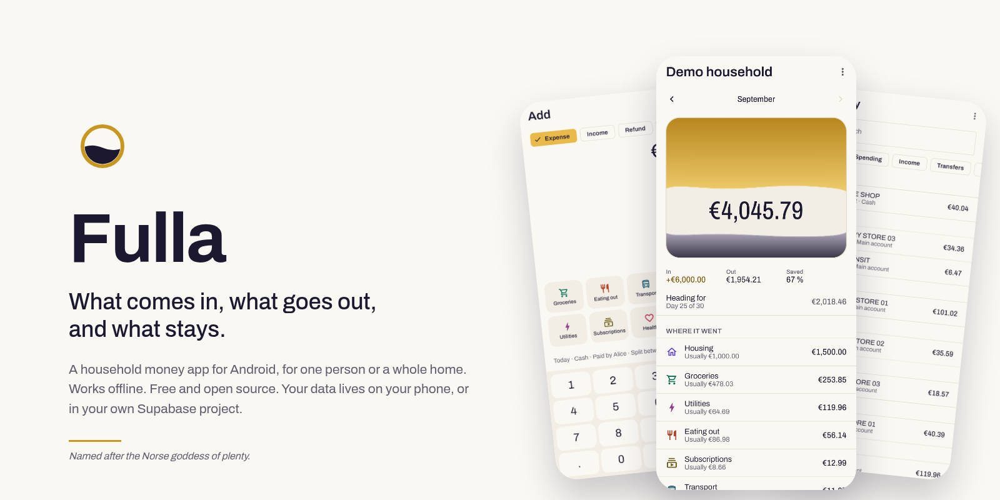

# Fulla

<picture>
  <source media="(prefers-color-scheme: dark)" srcset="docs/brand/readme-hero-dark.png">
  
</picture>

[](https://github.com/SirAllap/fulla/releases/latest)
[](https://github.com/SirAllap/fulla/actions/workflows/ci.yml)
[](LICENSE)

**[sirallap.github.io/fulla](https://sirallap.github.io/fulla/)** · [Download](https://github.com/SirAllap/fulla/releases/latest) · [Get started](#get-started)

Fulla keeps a household's money straight: what came in, what went out, what
is left, and who owes whom. It is an Android app for one person or a whole
household. It works offline, it collects nothing, and your data lives on your
phone or in a database you own.

It is named after Fulla, the Norse goddess of plenty, whose name means
*full* and who wore a golden band. The app draws your month as a vessel that
fills; the golden band is its icon.

> **0.1 — first public release.** The backend, the domain logic and the sync
> are complete and tested, and the app is in daily use on real phones. Expect
> rough edges, and please [report them](https://github.com/SirAllap/fulla/issues/new/choose).

## Get started

**Just you, on one phone** (two minutes):

1. Download `fulla-<version>.apk` from the
   [latest release](https://github.com/SirAllap/fulla/releases/latest) and
   open it on your phone. Android asks once to allow installs from your
   browser or file manager: allow it, then install.
2. Open Fulla and tap **Get started**. Name the household, and you are in.

**Shared with your household** (about five minutes, once; everyone else just
scans a QR code):

1. Install the app as above.
2. Create a free account at
   [supabase.com/dashboard/sign-up](https://supabase.com/dashboard/sign-up).
   Supabase is the database. Your household's data lives in *your* account;
   nobody else, Fulla's authors included, can read it.
3. Create an access token at
   [supabase.com/dashboard/account/tokens](https://supabase.com/dashboard/account/tokens):
   **Generate new token**, any name, then **copy** it.
4. In Fulla: **More options → Shared**, paste the token, tap **Set up my
   project**. The app creates the project, installs the database and connects,
   in a minute or two. The token is not kept; you can delete it afterwards.
5. Create your account in the app (an email and a password), then the
   household.
6. **Settings → People → Create an invite.** The others install Fulla, tap
   **I have an invite** and scan the QR code. They never touch Supabase.

**New phone, or reinstalled the app?** Nothing is lost. Make a fresh token
(step 3) and paste it in **Shared**: the app finds your project and
reconnects. Then **I already have an account**.

The whole setup, and doing it by hand, is in
[docs/self-hosting.md](docs/self-hosting.md).

## What it does

- Expenses, income, refunds, transfers between your own accounts, and
  settlements between people.
- Households of one to about ten people, with owner, admin and member roles,
  and members without an account (children, or anyone who doesn't use the app).
- Splits: equally, by shares or by exact amounts. A running balance per person,
  and the fewest payments that settle it.
- Budgets per category, with a default for every month and overrides for
  particular ones.
- Recurring items, custom fields, tags, subcategories, and months that start
  on payday if you want them to.
- Import from your bank or another app: CSV (columns recognised in six
  languages, mapped once), OFX or QIF. Importing the same file twice changes
  nothing.
- Backups to a file, and CSV export.
- Any currency; English, Spanish, French, German, Italian and Portuguese.
- Works offline. Sync settles conflicts the same way on every phone.

## Your data

Fulla has no server of its own and collects nothing: no analytics, no
telemetry, no crash reporting, no ads.

- **On this phone only**, everything stays on the device.
- **Shared**, it lives in a free Supabase project in *your* account. Everyone
  in the household signs in to that project. You can go from one phone to
  shared at any time without losing anything.

The app talks only to your own `<project>.supabase.co`, with two exceptions
you can see coming: setting a project up from a token reaches Supabase's
`api.supabase.com` for those few minutes, and checking for updates asks
`api.github.com` and downloads from GitHub. [docs/privacy.md](docs/privacy.md)
lists everything and explains how to check it yourself with a proxy.

## Updates

Fulla ships only as signed APKs on
[GitHub Releases](https://github.com/SirAllap/fulla/releases), never through
Google Play. You install it by hand once; after that the app finds new
releases itself, shows that one is waiting, and downloads and installs it from
**Settings** when you say so. Checking is on by default and can be turned off
in **Settings › About**. Android checks that every update is signed with the
same key as the app you have.

## Development

```
core/                  the app's logic in plain Kotlin: money, sync, splits, analytics, importers
client/                the protocol in plain Kotlin: wire format, Supabase transport, sync, setup, updates
app/                   the Android app (Jetpack Compose)
supabase/migrations/   the database: tables, row level security, and the API
supabase/tests/        a suite that runs the real migrations on a real PostgreSQL
supabase/scripts/      setup.sql bundler and migration runner
testdata/              defaults and test vectors shared by the database and the app
tools/                 the leak scanner and the translation check
docs/                  architecture, sync, API, data model, design, decisions
```

```sh
./gradlew :core:test :client:test   # the domain and the protocol; needs a JDK 17+
npm run test:db                     # the database; needs PostgreSQL installed (not running)
npm run i18n                        # every language has every string
npm run leakcheck                   # no secrets or personal data in the working tree
npm run hooks:install               # run that scan on every commit
```

The database suite starts its own throwaway PostgreSQL in a temporary
directory and never touches a real project (`apt install postgresql` is
enough on Debian or Ubuntu). The Android app builds in CI, which publishes a
debug APK to the [`latest-debug`](https://github.com/SirAllap/fulla/releases/tag/latest-debug)
prerelease on every change.

[CONTRIBUTING.md](CONTRIBUTING.md) before a pull request,
[AGENTS.md](AGENTS.md) for the rules the code depends on,
[docs/design.md](docs/design.md) for the design system, and
[SECURITY.md](SECURITY.md) to report a vulnerability privately.

## Licence

Fulla is free software under the [GNU General Public License v3.0 or later](LICENSE):
anyone may use, study, change and share it, and whoever distributes it, changed
or not, passes on the same freedoms with the source. Third-party components keep
their own licences, listed in [THIRD_PARTY_NOTICES.md](THIRD_PARTY_NOTICES.md).
